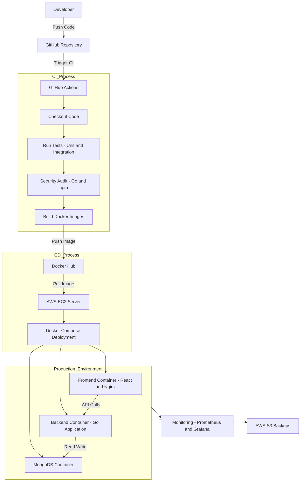
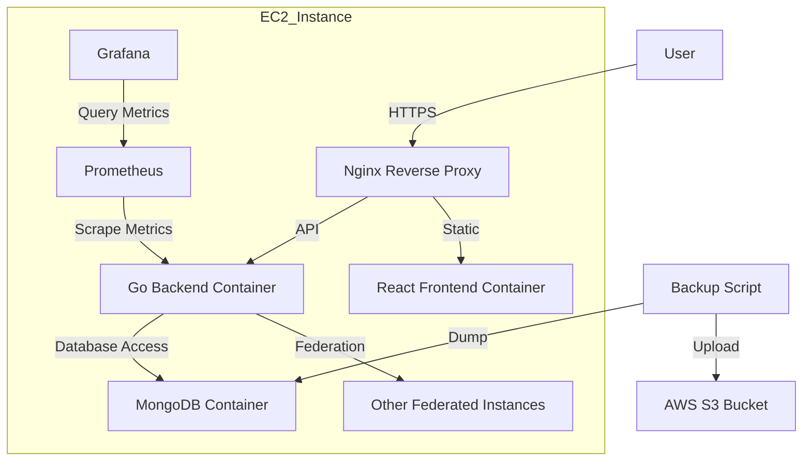

# DEVOPS STRATEGY

## Federated Decentralized Social Networking Platform

Reference:

* Problem Statement – 
* EPICS & Design – 

---

# 1. DevOps Vision

The DevOps strategy for this project ensures:

* Automated build, test, and deployment
* Secure and scalable multi-instance federation
* High availability and monitoring
* Data protection and backup automation
* Continuous integration and delivery (CI/CD)

Since the platform is federated, each instance must:

* Be independently deployable
* Maintain local autonomy
* Interoperate securely with other instances

---

# 2. High-Level DevOps Architecture

The following diagram illustrates the CI/CD pipeline and deployment flow:




---

# 3. Component-Wise DevOps Mapping

---

## 3.1 Frontend (React + Vite)

### Source Code Repository

```
/frontend
```

### Deployment Location

* AWS EC2 (Docker container)
* Nginx (serving static build)

### Pre-Deployment Tests

* Unit tests (Vitest / React Testing Library)
* ESLint checks
* TypeScript compilation check
* Production build validation

### Tools & Platforms

* Vite
* React
* Docker (Multi-stage build)
* Nginx
* GitHub Actions

---

## 3.2 Backend (Go)

### Source Code Repository

```
/backend
```

### Deployment Location

* AWS EC2 (Docker container)
* Native Go binary execution

### Pre-Deployment Tests

* Unit tests (`go test ./...`)
* Integration tests
* API endpoint validation
* Security audit (`govulncheck`)

### Tools & Platforms

* Go (Golang)
* Gorilla Mux (Router)
* Docker (Alpine based)
* GitHub Actions

---

## 3.3 Database (MongoDB)

### Source Code Repository

* Schema definitions inside backend repository (Go structs)

### Deployment Location

Option A: MongoDB Atlas (Cloud Managed)
Option B: Dockerized MongoDB on EC2 (Current Configuration)

### Pre-Deployment Tests

* Connection check
* Index verification
* Data persistence validation

### Tools & Platforms

* MongoDB 7.0
* MongoDB Drivers (Go)
* MongoDB Dump/Restore

---

## 3.4 Federation Service

Handles:

* Cross-instance follow
* Post forwarding
* Comment synchronization
* Async activity processing

### Source Code Repository

```
/backend/epics/federation
```

### Deployment Location

* Integrated into Backend Docker container (runs as Goroutines)

### Pre-Deployment Tests

* Federation protocol validation
* ActivityPub simulation
* Inter-instance connectivity tests

### Tools & Platforms

* Go Concurrency (Goroutines/Channels)
* HTTP Client
* JSON Activity Streams

---

## 3.5 AI Moderation Service (Planned)

Responsible for:

* Spam detection
* Offensive content detection
* Trust scoring

### Source Code Repository

* *To be created*

### Deployment Location

* Separate Docker container or Microservice

### Pre-Deployment Tests

* Model accuracy testing
* Latency checks

### Tools & Platforms

* Python (Likely FastAPI)
* Machine Learning Models
* Docker

---

## 3.6 Monitoring & Logging

### Deployment Location

* Prometheus + Grafana (EC2)
* Docker Logs

### Checks Performed

* Container health status
* Resource usage (CPU/Memory)
* Application error rates
* Federation queue depth

### Tools

* Prometheus
* Grafana
* Go `log` package / Structured Logger

---

## 3.7 Backup & Security

### Deployment Location

* AWS S3 for backups
* Encrypted Secrets (Env vars)

### Pre-Deployment Checks

* Environment variable presence
* SSL/TLS Certificate validity
* Backup script execution test

### Tools

* AWS CLI / S3
* Cron Jobs
* Let's Encrypt (Certbot)

---

# 4. CI/CD Pipeline Strategy

## Continuous Integration (CI)

Triggered on:

* Pull Request
* Push to main branch

Steps:

1. **Checkout Code**
2. **Backend Validation**:
    - Setup Go environment
    - `go mod tidy`
    - `go test ./...`
    - `go build`
3. **Frontend Validation**:
    - Setup Node.js
    - `npm install`
    - `npm run build`
4. **Docker Build**:
    - Build backend image
    - Build frontend image

---

## Continuous Deployment (CD)

Triggered after successful CI (on main branch):

1. **Push Images**: Push tagged Docker images to registry.
2. **Deploy**:
    - SSH into Production EC2
    - `git pull` (for docker-compose updates)
    - `docker-compose pull`
    - `docker-compose up -d --remove-orphans`
3. **Verify**:
    - Check container status (`docker ps`)
    - Curl health endpoints

---

# 5. Environments

| Environment | Purpose                     | Configuration |
| ----------- | --------------------------- | ------------- |
| Development | Local Docker setup          | `docker-compose.yml` (Local) |
| Staging     | Pre-production EC2 instance | `docker-compose.prod.yml` (Remote) |
| Production  | AWS EC2 + Domain + SSL      | `docker-compose.prod.yml` (Remote + SSL) |

---

# 6. Pre-Deployment Checklist

* [ ] Code reviewed and merged
* [ ] All tests passed (CI green)
* [ ] Docker images built and pushed
* [ ] Environment variables configured (.env)
* [ ] Database backups verified
* [ ] Domain DNS propagated
* [ ] SSL Certificates valid

---

# 7. DevOps Tools Summary

| Layer                | Tool                 |
| -------------------- | -------------------- |
| Version Control      | Git + GitHub         |
| CI/CD                | GitHub Actions       |
| Containerization     | Docker + Compose     |
| Cloud Infrastructure | AWS EC2              |
| Database             | MongoDB (Docker/Atlas)|
| Backend Runtime      | Go (Golang)          |
| Frontend Runtime     | Node.js / Nginx      |
| Monitoring           | Prometheus + Grafana |
| Security             | JWT + SSL/TLS        |
| Backup               | AWS S3               |

---

# 8. Deployment Architecture Diagram




---

# 9. Why This DevOps Strategy Fits a Federated System

* **Modularity**: Separation of Frontend, Backend, and Database in Docker containers allows independent scaling and updates.
* **Autonomy**: Each instance runs its own full stack, ensuring data sovereignty.
* **Resilience**: Docker restart policies and automated backups minimize downtime and data loss.
* **Standardization**: Docker Compose ensures consistent environments across development and production.
* **Performance**: Go backend provides high-performance concurrency essential for handling federation activities.
