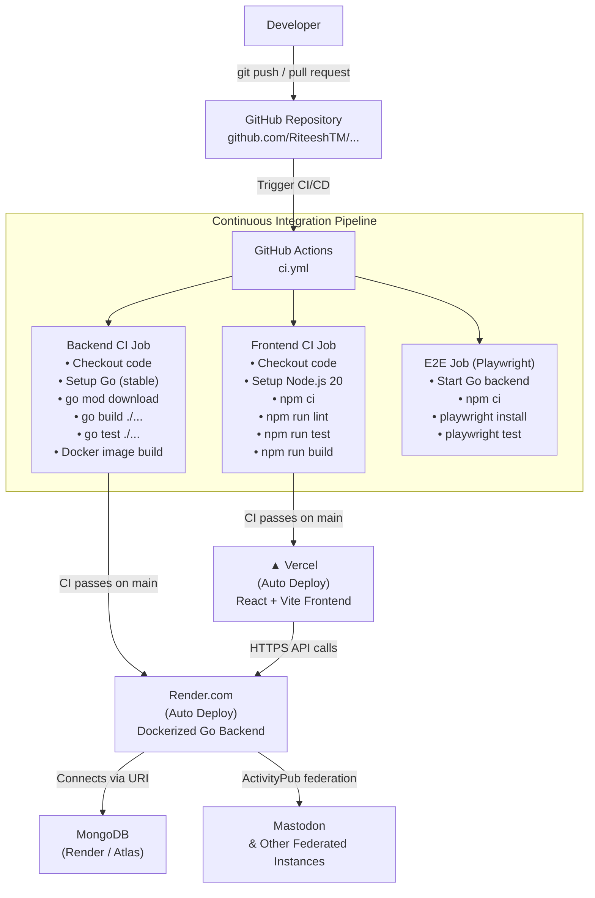

# DEVOPS STRATEGY

## Federated Decentralized Social Networking Platform

**GitHub Repository:** https://github.com/RiteeshTM/Federated-Decentralized-Social-Networking-Platform

---

# 1. DevOps Overview

The DevOps strategy for this platform automates testing, building, and deployment through a continuous integration and continuous deployment (CI/CD) pipeline powered by **GitHub Actions**. Every push to the `main` branch triggers the pipeline, which validates code quality, runs all tests, verifies the production build, and automatically deploys each component to its respective cloud platform.

Key goals of this strategy:

- **Automated quality gates** — No broken build reaches production
- **Zero-touch deployment** — Merging to `main` is sufficient to ship to production
- **Independent component delivery** — Frontend (Vercel) and Backend (Render) deploy separately, minimising blast radius
- **Federation readiness** — Each instance is self-contained and can operate autonomously while interoperating via ActivityPub

---

# 2. System Architecture



---

# 3. System Components

## 3.1 Frontend (React + Vite)

| Property | Detail |
|---|---|
| **Source Repository** | `/frontend` on GitHub |
| **Framework** | React 18, TypeScript, Vite |
| **Deployment Platform** | Vercel |
| **Containerisation** | None — Vercel builds directly from source |
| **Deployment Trigger** | Automatic on push to `main` |

### Build Process
Vercel runs `npm run build` (Vite production build) from the `/frontend` directory. The output is a set of static assets served via Vercel's global CDN.

### Pre-Deployment Checks (CI)
1. `npm ci` — Install exact dependency versions
2. `npm run lint` — ESLint code quality checks
3. `npm run test` — Vitest unit tests + React Testing Library
4. `npm run build` — TypeScript compilation + Vite production bundle

---

## 3.2 Backend (Go / Golang)

| Property | Detail |
|---|---|
| **Source Repository** | `/backend` on GitHub |
| **Language** | Go (Golang) |
| **Router** | Gorilla Mux |
| **Deployment Platform** | Render.com |
| **Containerisation** | Docker (Alpine-based multi-stage build) |
| **Deployment Trigger** | Automatic on push to `main` |

### Docker Build Process
The backend `Dockerfile` uses a two-stage build:
1. **Builder stage** — `golang:alpine` compiles a static binary (`CGO_ENABLED=0`)
2. **Runtime stage** — `alpine:latest` runs the minimal binary

Render pulls the GitHub repository, builds the image, and replaces the running container with zero-downtime.

### Pre-Deployment Checks (CI)
1. `go mod download` — Fetch all declared dependencies
2. `go build ./...` — Verify the entire codebase compiles
3. `go test ./...` — Unit tests + integration tests (with a live MongoDB service container)
4. `docker build -t backend-test .` — Confirm the Docker image builds successfully

---

## 3.3 Database (MongoDB)

| Property | Detail |
|---|---|
| **Type** | MongoDB |
| **Deployment** | Render Managed Database **or** MongoDB Atlas |
| **Schema** | Defined as Go structs in `/backend/epics/*/models/` |
| **Connection** | Injected via `MONGODB_URI` environment variable |

### Connection Configuration
The backend reads the database connection from the `MONGODB_URI` environment variable. No credentials are stored in code. Render and Vercel both provide secret environment variable storage in their dashboards.

| Environment Variable | Purpose |
|---|---|
| `MONGODB_URI` | Full MongoDB connection string |
| `JWT_SECRET` | JWT signing key |
| `INSTANCE_DOMAIN` | ActivityPub instance domain |
| `VITE_API_URL` | Backend URL consumed by the frontend |

---

## 3.4 Federation Service

The federation layer is implemented as Go goroutines inside the backend container. It implements the **ActivityPub** protocol for cross-instance operations:

- Follow/Unfollow remote users
- Deliver posts to remote inboxes (Create, Delete activities)
- Process incoming activities (Accept, Like, Create)
- Retry queue with exponential back-off (US3.7)
- User-controlled federation toggle (US3.8)

No separate deployment is required — it starts automatically with the backend.

---

# 4. Continuous Integration (CI)

CI is handled by **GitHub Actions** (`.github/workflows/ci.yml`) and runs on every push to `main` or `dev`, and on all pull requests targeting `main`.

## Pipeline Jobs

```yaml
# Simplified view of ci.yml

jobs:

  backend:                          # Go backend validation
    - Checkout code
    - Setup Go (stable)
    - go mod download
    - go build ./...                # Compile check
    - go test ./...                 # Unit + integration tests
    - docker build -t backend-test . # Docker image smoke test

  frontend:                         # React frontend validation
    - Checkout code
    - Setup Node.js 20
    - npm ci
    - npm run lint                  # ESLint
    - npm run test                  # Vitest
    - npm run build                 # TypeScript + Vite bundle

  e2e:                              # End-to-end Playwright tests
    - Checkout code
    - Start Go backend (go run main.go &)
    - npm ci
    - playwright install --with-deps
    - playwright test
```

> **Note:** The backend CI job spins up a real MongoDB service container (`mongo:latest` on port 27017) so integration tests run against an actual database engine.

---

# 5. Continuous Deployment (CD)

## Frontend CD — GitHub → Vercel

1. Developer merges to `main`
2. GitHub Actions **Frontend CI** job runs and passes
3. Vercel detects the push via GitHub integration and **automatically triggers a deployment**
4. Vercel runs `npm run build` and publishes static assets to its CDN
5. New version is live on the Vercel URL

## Backend CD — GitHub → Docker → Render

1. Developer merges to `main`
2. GitHub Actions **Backend CI** job runs and passes (including Docker build check)
3. Render detects the push via GitHub integration and **automatically triggers a deployment**
4. Render builds the Docker image from the repository's `Dockerfile`
5. The new container replaces the old one with zero-downtime deployment
6. Backend is live on the Render service URL

---

# 6. Deployment Workflow — Step by Step

```
1. Developer writes code locally
2. Developer opens a Pull Request → CI runs on the PR branch
3. Reviewer approves and merges to main
4. GitHub Actions automatically starts:
   ├── Backend CI job (Go build, tests, Docker build)
   ├── Frontend CI job (lint, tests, Vite build)
   └── E2E job (Playwright tests against live backend)
5. IF all jobs pass:
   ├── Vercel auto-deploys the updated frontend
   └── Render auto-deploys the updated backend Docker container
6. Application is live and available to users
```

---

# 7. Pre-Deployment Checks Summary

| Check | Tool | Component |
|---|---|---|
| Dependency resolution | `go mod download` / `npm ci` | Backend / Frontend |
| Code compilation | `go build ./...` | Backend |
| TypeScript type checking | Vite build | Frontend |
| Code linting | ESLint (`npm run lint`) | Frontend |
| Unit tests | `go test ./...` / Vitest | Backend / Frontend |
| Integration tests | `go test ./...` + MongoDB service | Backend |
| Docker image builds | `docker build` | Backend |
| End-to-end tests | Playwright | Full stack |
| Environment variable presence | Render / Vercel dashboard | Both |

---

# 8. DevOps Tools and Platforms

| Tool / Platform | Purpose |
|---|---|
| **GitHub** | Version control and source of truth |
| **GitHub Actions** | CI/CD pipeline automation |
| **Docker** | Containerisation of the Go backend |
| **Render.com** | Dockerized backend deployment and managed MongoDB |
| **Vercel** | Frontend static hosting and CDN |
| **MongoDB** | Primary database (Atlas or Render managed) |
| **Go (Golang)** | Backend language and runtime |
| **Vite + React** | Frontend build tooling and framework |
| **Playwright** | End-to-end browser test automation |
| **Vitest** | Frontend unit test runner |
| **Gorilla Mux** | HTTP router for the Go backend |
| **ActivityPub** | Federation protocol for cross-instance communication |

---

# 9. Environments

| Environment | Frontend | Backend | Database |
|---|---|---|---|
| **Local Development** | `npm run dev` (Vite dev server) | `go run main.go` or `docker-compose up` | Docker MongoDB container |
| **Production** | Vercel CDN | Render Docker container | Render / Atlas MongoDB |

---

# 10. Why This DevOps Strategy Fits a Federated System

- **Independent deployability** — Frontend and backend deploy separately; a frontend change never blocks a backend fix.
- **Containerisation** — Docker ensures the Go backend behaves identically in local development and on Render, eliminating environment drift.
- **Automated quality gates** — No code reaches production without passing compilation, unit tests, and a successful Docker build.
- **Scalability** — Multiple platform instances can be deployed identically from the same repository, each connecting to its own MongoDB, enabling true federation.
- **Protocol compliance** — The ActivityPub federation layer deployed inside every backend instance allows interoperability with Mastodon and other fediverse platforms.
