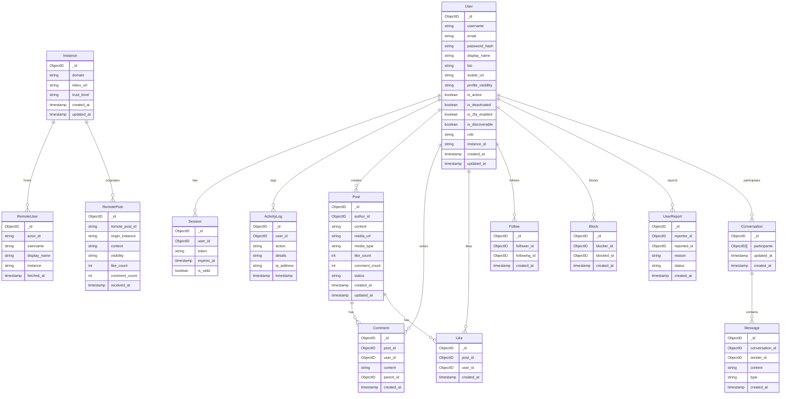

# DATABASE SCHEMA (MongoDB)

## Federated Decentralized Social Networking Platform

# 1. Overview

The system uses **MongoDB** as a document-oriented database.

Each instance is self-contained and stores:

* Local users
* Local posts
* Federation metadata
* Moderation records
* Messaging data

Although MongoDB is schema-less, we define a **logical schema design** to ensure:

* Data consistency
* Referential clarity
* Clean API contracts
* Maintainability

Below is the conceptual schema represented using a Mermaid ER diagram.

---

# 2. Schema Diagram

---

# 3. Collection Descriptions

## Identity Collections

### users

Stores core user data including authentication, privacy settings, and profile metadata.

### sessions

Stores active login sessions and tokens.

### activity_logs

Stores audit information for security and monitoring.

---

## Content Collections

### posts

Stores user-generated content.

### comments

Stores comments on posts.

### likes

Tracks post likes.

### follows

Tracks local follow relationships.

---

## Federation Collections

### instances

Stores metadata about federated servers.

### remote_users

Caches remote profiles.

### remote_posts

Caches posts from external instances.

---

## Safety Collections

### blocks

Tracks user blocking relationships.

### user_reports

Tracks user-to-user reports.

---

## Messaging Collections

### conversations

Represents chat threads.

### messages

Stores individual messages in conversations.

---

# 4. Design Rationale

This schema design supports:

* Instance autonomy
* Federation through cached remote objects
* Soft relationship references via ObjectIDs
* Scalable document storage
* Efficient read-heavy social workloads

MongoDB was chosen because:

* It handles flexible document structures
* Federation payloads (ActivityPub JSON) map naturally to BSON
* It supports horizontal scaling

---

# 5. Key Architectural Decisions

* Relationships are maintained using ObjectID references
* Counters like like_count are denormalized for performance
* Remote objects are cached locally for federation efficiency
* Soft-deletion is supported via status fields
* Messaging uses embedded conversation references

---

# 6. Why This Schema Fits a Federated Platform

* Each instance stores only its local data
* Remote data is cached, not owned
* Federation events are stored asynchronously
* Moderation and safety are instance-scoped

This aligns with decentralized governance and digital sovereignty principles.
